# Code Flow — Execution Trace Through the Pipeline

Companion to `docs/Code_Reference_Stages_And_Metrics.md` (what each stage's
core logic does) and `docs/Implementation_Methodology.md` (why). This
document traces **execution order** — what calls what, in what sequence,
with what data passed between calls — from a raw note string to a
(dry-run) KG3 write or a HITL queue entry. Every function name below is
real and current; the call order is copied from the actual entry-point
docstrings and source, not inferred.

---

## 1. End-to-end flowchart

```mermaid
flowchart TD
    A["raw_text (one discharge note)"] --> B["run_pipeline(note_id, raw_text, conn)"]

    subgraph S1["Stage 1 — Preprocessing"]
        B --> C["process_and_store_note()"]
        C --> C1["expand_text_and_track_offsets()<br/>abbreviation tiebreak chain"]
        C1 --> D["expanded_text + stage1_provenance"]
    end

    subgraph S2A["Stage 2a — Extraction"]
        D --> E["extract_and_store_entities()"]
        E --> E1{"word count ><br/>CHUNK_WORD_BUDGET?"}
        E1 -- yes --> E2["_extract_entities_chunked()<br/>128-token overlap"]
        E1 -- no --> E3["model.predict_entities()<br/>GLiNER-BioMed"]
        E2 --> E3B{"CNSP_GLINER_GAZETTEER_<br/>FALLBACK enabled?<br/>(off by default)"}
        E3 --> E3B
        E3B -- yes --> E3C["recover_missed_entities()<br/>24 gold-verified terms<br/>(13 orig + 11 added 2026-09-01)"]
        E3B -- no --> E4
        E3C --> E4["annotate_assertions()"]
        E4 --> F["extract_and_store_relations()<br/>GLiNER-relex"]
        F --> G["sub-threshold filter<br/>accepted vs subthreshold"]
        G --> H["cold-start injectors<br/>physexam / lab-abbrev / narrative-state"]
        H --> I["grow_entity_spans()"]
        I --> J["split_compound_entities()"]
    end

    subgraph S2B["Stage 2b — Normalization / Grounding"]
        J --> K["process_and_normalize_entities()"]
        K --> K1["normalize_entity() — per entity"]
        K1 --> K2["Tier 1 exact / Tier 2 synonym /<br/>Tier 3 SapBERT semantic<br/>(SCTID namespace exclusion applied)"]
        K2 --> K3["_prefer_lab_procedure_over_observable()<br/>rank penalty"]
        K3 --> K4["_collapse_hierarchy_duplicates()"]
        K4 --> L["normalized_entities.candidates<br/>(written to DB, keyed on<br/>entity_id+expanded_text since 2026-09-01)"]
    end

    L --> M["Stage 3 batch runner<br/>scripts/run_stage3_tier_gate.py"]

    subgraph S3["Stage 3 — MoLLM Tier Gate"]
        M --> M1["load_validation_records()"]
        M1 --> N["route_tier(entity)"]
        N --> N1{"qualifier_fragment_precheck()"}
        N1 -- hit --> Z1["return HITL"]
        N1 -- miss --> N2{"tier3_fast_path() /<br/>_lab_procedure_fast_path()"}
        N2 -- hit --> Z2["TIER_3_AUTO_VALIDATED<br/>(zero LLM calls)"]
        N2 -- miss --> N3{"tier5_precheck()"}
        N3 -- hit --> Z3["TIER_5_TRUE_AMBIGUITY"]
        N3 -- miss --> N4["run_two_step_ensemble()"]
        N4 --> N5["3x _evaluate_one_model()<br/>(parallel, qwen/llama/phi4-mini)"]
        N5 --> N6{"3/3 unanimous?"}
        N6 -- "SUPPORTED_1" --> N7["_fragile_shorthand_trap() check<br/>then confidence floor"]
        N7 --> Z4["TIER_1_AUTO_VALIDATED"]
        N6 -- "RE_RANK_TO_N" --> N8["ConsensusCalibrator escape hatch"]
        N8 --> Z5["TIER_2_AUTO_RESOLVED<br/>(excluded from AUTO_TIERS)"]
        N6 -- "split 2-1 / 1-1-1" --> N9["_is_coronary_segment_trap() /<br/>_is_short_alphanumeric_code() /<br/>calibrator.score()"]
        N9 -- "score >= 0.78" --> Z6["TIER_1B_CALIBRATED_AUTO_VALIDATED"]
        N9 -- "below threshold / trapped" --> Z7["TIER_4_ENSEMBLE_SPLIT"]
    end

    Z2 --> O["store_tier_decision()"]
    Z4 --> O
    Z5 --> O
    Z6 --> O
    Z7 --> O
    Z3 --> O

    subgraph S4["Stage 4 — Routing & Ingestion"]
        O --> P{"tier in AUTO_TIERS?"}
        P -- yes --> Q["ingest_auto_decision()<br/>dry_run=True → Memgraph :PatientObservation"]
        P -- no --> R["hitl_queue.enqueue_pending_cases()<br/>→ hitl_review_queue"]
        R --> S["ui/pages/2 HITL Review Queue<br/>human reviewer"]
        S -.approved/corrected.-> Q
    end
```



---

## 2. Textual call trace (Stage 1 → 2b), with real function names

`src/clinical_pipeline.py :: run_pipeline(note_id, raw_text, conn, is_test)`
is the single entry point for Stages 1-2b. Call order, exactly as it
appears in the source:

```
run_pipeline(note_id, raw_text, conn, is_test)
│
├─ process_and_store_note(note_id, raw_text, conn, is_test)
│    └─ expand_text_and_track_offsets(text, abbrev_dict, conn)
│         → (expanded_text, stage1_provenance)
│
├─ extract_and_store_entities(note_id, expanded_text, raw_text,
│                              stage1_provenance, conn, is_test)
│    ├─ model.data_processor.words_splitter(expanded_text)   # cheap pre-check
│    ├─ [len(words) > CHUNK_WORD_BUDGET]
│    │     → _extract_entities_chunked()  |  model.predict_entities()
│    ├─ annotate_assertions(expanded_text, spans)
│    └─ store_entities(conn, processed_entities, is_test)
│         → entities: list[dict]
│
├─ extract_and_store_relations(note_id, expanded_text, conn,
│                               entities=entities, is_test)
│    → relations: list[dict]              # GLiNER-relex, independent model
│
├─ [split accepted / subthreshold on below_threshold]
│
├─ build_physexam_shorthand_entities(raw_text, sections, note_id, entities)
│    → store_entities(...) if any; accepted += physexam_entities
│
├─ build_lab_abbrev_coldstart_entities(raw_text, note_id, accepted)
│    → store_entities(...) if any; accepted += lab_abbrev_entities
│
├─ build_narrative_state_word_entities(raw_text, note_id, accepted)
│    → store_entities(...) if any; accepted += narrative_entities
│
├─ grow_entity_spans(accepted, conn, note_id, raw_text,
│                     expanded_text, stage1_provenance, is_test)
│    → accepted (grown spans)
│
├─ split_compound_entities(accepted, conn, note_id, raw_text,
│                           expanded_text, stage1_provenance, is_test)
│    → accepted (compound spans split)
│
├─ [if ACRONYM_ESCALATION_ENABLED (off by default)]
│    resolve_ambiguous_acronyms(accepted, raw_text, note_id, conn)
│
└─ process_and_normalize_entities(accepted, conn, is_test)
     │
     └─ FOR EACH entity:
          normalize_entity(entity_text, conn, gliner_label, ...)
          │
          ├─ Tier 1: exact concept-name match       (SQL, +_UK_EXTENSION_EXCLUSION)
          ├─ Tier 2: exact synonym match             (SQL, +_UK_EXTENSION_EXCLUSION)
          ├─ Tier 3: _tier3_semantic_rows()           (SapBERT cosine, +exclusion)
          │    ├─ alias_ids force-included (_LAB_TEST_ALIASES, brand→generic)
          │    └─ TIER3_SIMILARITY_FLOOR gate
          ├─ _prefer_lab_procedure_over_observable()  (rank-only penalty)
          ├─ _collapse_hierarchy_duplicates()         (union-find on SNOMED "Is a")
          └─ → candidates: list[dict], written to normalized_entities.candidates
     → {"note_id", "expanded_text", "entities", "relations", "normalized"}
```

---

## 3. Textual call trace (Stage 3), `route_tier()`

`scripts/run_stage3_tier_gate.py :: main()` drives Stage 3 as a separate,
later batch process — it does **not** call `run_pipeline()` again; it
reads Stage 2b's already-stored `normalized_entities.candidates`.

```
main()  [scripts/run_stage3_tier_gate.py]
│
├─ preflight(MODEL_NAMES)                    # confirms Ollama models are pulled
├─ ConsensusCalibrator.load(path, scoring_note_ids=note_ids)   # leakage guard
├─ build_clients()                           # qwen2.5:3b, llama3.2:3b, phi4-mini
│
└─ FOR EACH note_id:
     load_validation_records(conn, note_id)   # reads normalized_entities.candidates
     │
     └─ FOR EACH record not already decided:
          route_tier(record, clients, calibrator, conn_factory)
          │
          ├─ qualifier_fragment_precheck(entity)        → free, no LLM
          ├─ tier3_fast_path(entity)                    → free, no LLM
          ├─ _lab_procedure_fast_path(entity)            → free, no LLM
          ├─ tier5_precheck(entity)                      → free, no LLM
          │
          ├─ [none of the above fired]
          │    run_two_step_ensemble(entity, clients)
          │    │
          │    └─ ThreadPoolExecutor, 3x in PARALLEL:
          │         _evaluate_one_model(client, entity)
          │         │
          │         ├─ Step A: client.complete(_clinical_meaning_prompt(entity))
          │         │    → clinical_meaning string, NO candidate list visible
          │         │
          │         └─ Step B: FOR candidate in candidates (starting at #1):
          │              client.complete(_binary_match_prompt(entity, candidate,
          │                                                   clinical_meaning))
          │              → {"match": bool, "reasoning": str}
          │              [EXHAUSTIVE_CANDIDATE_EVAL_ENABLED: keep going past
          │               first accept; 2+ accepts → _resolve_tiebreak()]
          │
          ├─ Counter(verdicts) → unanimous? top_verdict? top_count?
          │
          ├─ [unanimous SUPPORTED_1]
          │    _fragile_shorthand_trap() → confidence floor check
          │    → TIER_1_AUTO_VALIDATED  |  HITL (trapped / below floor)
          │
          ├─ [unanimous RE_RANK_TO_CANDIDATE_N]
          │    _score_with_calibrator(entity, model_results, n, calibrator)
          │    → TIER_2_AUTO_RESOLVED (always HITL-routed, excluded from AUTO_TIERS)
          │
          ├─ [split vote, 2-1 or 1-1-1]
          │    _is_coronary_segment_trap() / _is_short_alphanumeric_code()
          │    calibrator.score(feature_vector) if not trapped
          │    → TIER_1B_CALIBRATED_AUTO_VALIDATED (score >= 0.78)
          │      | TIER_4_ENSEMBLE_SPLIT (otherwise)
          │
          └─ store_tier_decision(decision, entity_id, note_id, conn, is_test)
               │
               └─ [decision["tier"] in AUTO_TIERS]
                    ingest_auto_decision(memgraph_driver, decision,
                                         entity_fields, dry_run=True)
                    → logs what WOULD be written, writes nothing live
```

---

## 4. Data-flow summary (what's actually passed between stages)

| From → To | Payload | Where it lands |
|---|---|---|
| raw note text → Stage 1 | `raw_text: str` | function argument |
| Stage 1 → Stage 2a | `expanded_text: str`, `stage1_provenance: dict` | `run_pipeline()` local vars |
| Stage 2a → Stage 2b | `accepted: list[dict]` (entity records, offsets, assertion status) | `extracted_entities` table |
| Stage 2b → Stage 3 | `candidates: list[dict]` (omop_concept_id, similarity_score, match_basis) | `normalized_entities.candidates` (JSON column) |
| Stage 3 → Stage 4 | `decision: dict` (tier, routing, final_candidate_index, models/eval_trail) | `mollm_tier_gate_decisions` table |
| Stage 4 → KG3 (dry-run) | `:PatientObservation` node params | Memgraph, `dry_run=True` |
| Stage 4 → HITL | queue row | `hitl_review_queue` table → `ui/pages/2` |

**Key property**: Stage 3 never re-touches Stage 2a/2b's output — it
strictly reads what Stage 2b already wrote. This is *why* the SNOMED
near-duplicate retrieval fix (§12 in the results doc) required a
dedicated re-normalization pass rather than "just restart Stage 3" — a
fix inside `normalize_entity()` only takes effect the next time Stage 2b
itself runs, never retroactively for already-stored candidates.
