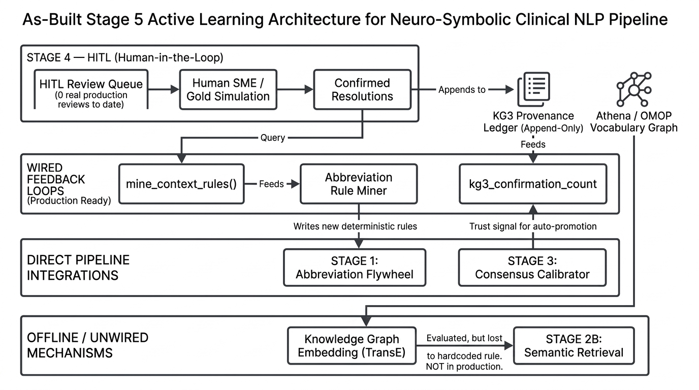

# Knowledge-Graph Grounding for the LLM Ensemble — Complete Technical Reference

**Sources**: `src/normalization/tier_retrieval.py`, `src/normalization/orchestrator.py`, `src/mollm_tier_gate.py`, `src/guideline_evidence.py`, `src/retrieval.py`'s `GuidelineIndex`, `src/tier4_kg_escalation.py`, `src/kg_embedding.py`, `src/kg3_query.py`, `src/kg3_ingestion.py` — every code snippet below is read from the live source, not reconstructed from memory. Cross-referenced against `docs/TransE_KG_Embedding_Technical_Reference.md`, `docs/KG3_Implementation_And_Feedback_Loop_Technical_Reference.md`, and `docs/FINAL_RESULTS_Single_Source_Of_Truth.md` §14 for measured results rather than re-deriving them.

**Independently re-verified 2026-08-31** (this session): every module named below was directly read and every measured result cross-checked against the docs that reported it.

---

## 1. There are three different graphs in this codebase, not one

The phrase "the knowledge graph" is ambiguous in this project and the ambiguity matters — each of the three real graphs grounds the LLM ensemble through a structurally different mechanism, with a different trust level and a different adoption status.

| Graph | What it is | Where it lives | Populated by | Grounds the LLM via |
|---|---|---|---|---|
| **Vocabulary graph** | SNOMED CT / OMOP's own concept-relationship ontology — `IS_A`, `Maps to`, `Tradename of`, etc. | `athena_concept`, `athena_concept_relationship`, `athena_concept_ancestor` (DuckDB) | Athena's standard OMOP vocabulary release — static, licensed reference data | Direct SQL walks injected as facts (§3), and as the training graph for TransE (§5) |
| **Guideline-triplet graph** | Curated clinical-guideline knowledge, extracted from 76 real source documents (KDIGO, Surviving Sepsis, AHA/ACC HF, NSTE-ACS, ESI triage, …) into `(node, predicate, node)` rules with rationale + citation | `data/local_triplets_db2_v6_cleaned_grounded_rules_added/*.json`, indexed in-memory by `GuidelineIndex` | A one-time curation/extraction pass over real guideline PDFs — not learned, not accumulated at runtime | Prompt-injected evidence blocks in the Stage 3 tiebreak (§4) |
| **KG3** | This project's own dynamic, patient-instance graph — `PatientObservation → Concept → MoLLMDecision → HITLReview` | Memgraph (`bolt://localhost:7688`) | The pipeline's own write-back loop (dry-run in production; a one-off gold-simulated population exists, see §6) | A calibrator feature, `kg3_confirmation_count` (§6) — the only mechanism below that's actually adopted in production |

Three genuinely different epistemic statuses feed the ensemble: **licensed reference fact** (vocabulary graph), **curated external authority** (guideline graph), and **the pipeline's own accumulated history** (KG3) — and the document below is organized by *how* each one reaches the model, not just what it contains.

---

## 2. The one invariant across every mechanism: evidence, never a verdict

Stated explicitly in more than one module's own docstring, and worth stating once here because it's the load-bearing design constraint the whole document sits on top of:

> `src/tier4_kg_escalation.py`: "KG facts are EVIDENCE the model weighs alongside the entity's own context, never a deterministic override that bypasses the model call... Earlier draft of this module had a 'apply_deterministic_kg_rule() short-circuits and skips the LLM entirely' path -- removed."

> `src/guideline_evidence.py`: "this only ever ADDS a factual evidence block to the tiebreak prompt; it never short-circuits or overrides model reasoning."

Every mechanism in §3-§6 obeys this, with one narrow, explicitly-justified exception (§3.1's brand-alias fast path, which bypasses the ensemble entirely — but only because it isn't really "evidence for the model to weigh" at all, it's a graph-*verified identity fact*, the same trust tier as a curated dictionary lookup, not a probabilistic hint).

---

## 3. The vocabulary graph — direct SQL walks as injected facts

### 3.1 Brand-to-generic: a real 3-hop walk, not a 1-hop lookup

`_alias_expand_brand_to_generic()` (`src/normalization/tier_retrieval.py`) solves the "Lasix problem": SapBERT's embedding space doesn't reliably place a brand name close to its active ingredient, so a brand-only mention can silently miss Tier 3's top-K even though the vocabulary graph itself has the answer.

```python
def _alias_expand_brand_to_generic(conn, search_text):
    """
    There is no direct 1-hop CONCEPT_RELATIONSHIP edge from a Brand Name
    concept to its generic ingredient (verified empirically against this DB:
    a 'Maps to'/'Tradename of' query straight from the brand concept returns
    nothing). The real path is three hops:
        brand -[Brand name of]-> branded product (Branded Drug Comp)
              -[Tradename of]-> generic Clinical Drug Comp (standard, RxNorm)
              -[RxNorm has ing]-> Ingredient (standard, RxNorm)
    ...
    Returns a (possibly empty) set of standard concept_ids.
    """
```

This is the **highest-trust** graph-derived fact in the whole system — walked live against real OMOP relationship edges, not inferred — which is why it's the one mechanism allowed to skip the ensemble entirely, via `tier3_fast_path()`'s `verified_brand_alias` branch (`src/mollm_tier_gate.py`): "graph-verified brand alias, the sole such hit... skipped the two-step ensemble entirely." The result also seeds `_LAB_TEST_ALIASES`-style force-inclusion into the Tier 3 candidate pool (`alias_ids` in `orchestrator.py`), the same force-include-not-force-rank mechanism §7's real bug affected for the lab-alias dict.

### 3.2 `tier4_kg_escalation.py` — real relationship/ancestor evidence, one experimental 8B call

Built as a genuine "does grounding the escalation call in real KG facts help" experiment for the population the 3B ensemble couldn't resolve. Three real queries, no guessing:

```python
def _kg_relationships_between(conn, id_a, id_b):
    """ALL SNOMED relationship types between two concepts, either direction
    -- not filtered to any specific pattern."""
    rows = conn.execute("""
        SELECT relationship_id FROM athena_concept_relationship
        WHERE ((concept_id_1 = ? AND concept_id_2 = ?)
            OR (concept_id_1 = ? AND concept_id_2 = ?))
        AND invalid_reason IS NULL
    """, [id_a, id_b, id_b, id_a]).fetchall()
```

Plus `_kg_closest_ancestor()` (real parent-of relationship, not a guess) and a same-name cross-check ("does any OTHER concept in the vocabulary share this exact name, and if so what domain/class is it — surfaces a duplicate-concept situation as a fact for the model to weigh, not a pre-decided answer"). Every candidate pair's real relationship types, closest ancestor, and name-collision status are formatted into one 8B-model prompt call — same "evidence, never override" discipline as everything else in this document.

**Status: built, smoke-tested, not adopted.** Per project history (this session's own memory record): a follow-on multi-round variant letting the model actively request more KG searches was also tried — "7/9 smoke-tested entities still declined to commit to a verdict after 2-4 search rounds ('I need more evidence, but I'm not sure what specific search would be helpful')." Conclusion: a 3-8B-class model doesn't reliably have the planning/executive function to drive its own search strategy. The one-shot pre-fetch design (`tier4_kg_escalation.py` itself, arbiter architecture, 51.0% precision) remains the reference design, but neither is currently wired into `route_tier()`'s live decision path.

### 3.3 `CONDITION_VS_OBSERVATION_PRIOR` — a corpus-measured prior, not a live graph query

Worth including here for completeness even though it's not a runtime graph walk: a hardcoded instruction block (`src/mollm_tier_gate.py`) injected into the tiebreak prompt whenever `_condition_vs_observation_duplicate()` detects two candidates sharing an exact concept name but split across the `Condition` and `Observation` OMOP domains — the same SNOMED near-duplicate shape the vocabulary graph's own domain field surfaces. Corpus-measured to be near-exceptionless ("10/11 want Observation regardless of section"), it's the generic version of the same problem the guideline-evidence mechanism (§4) was hoped to make more specific.

---

## 4. The guideline-triplet graph — curated external authority, prompt-injected

Full detail already in `docs/ConsensusCalibrator_Technical_Reference.md`'s cross-references and the guideline-evidence integration plan (`/home/ec2-user/.claude/plans/here-is-details-of-peppy-pixel.md`); summarized here for completeness of the grounding picture.

**Mechanism**: `GuidelineIndex` (`src/retrieval.py`) loads 76 curated JSON-LD files (1,700 nodes, 1,162 rules) into an in-memory index, keyed by node **name** — deliberately not SNOMED code, since the corpus's own curators flagged cases where one code covers multiple genuinely distinct concepts. `guideline_evidence_for_candidates()` (`src/guideline_evidence.py`) looks up each Stage 3 tiebreak candidate's name, applies a soft type/domain compatibility filter, and formats matching rules (with `rationale` + `citation`) into a prompt block:

```
OFFICIAL GUIDELINE EVIDENCE (from curated clinical-guideline triplets,
not a similarity guess -- weigh this as real evidence, it does not
decide the answer for you): ...
```

**Status: measured, not adopted.** `GUIDELINE_EVIDENCE_ENABLED` stays off. A real, live A/B test (`evaluation/guideline_evidence_ab_test.py`, 2026-08-30, 23 gradable paired entities, both arms run through real live LLM calls) found **zero flips** — identical correctness with the evidence on vs. off. Root-caused, not assumed: the real matched evidence is consistently one-sided background context about the single candidate already favored ("aspirin is standard therapy for ACS"), never a fact that discriminates between the two tied candidates actually causing the split vote. Full result: `docs/FINAL_RESULTS_Single_Source_Of_Truth.md` §11.

---

## 5. TransE — the vocabulary graph, embedded

`src/kg_embedding.py` trains a real TransE model (Bordes et al. 2013, plain PyTorch) directly on the vocabulary graph's own edges — 7,269 concepts, ~24,900 relationship edges, 104 relation types, scoped to what this pipeline's own candidate pools actually touch. Full detail in `docs/TransE_KG_Embedding_Technical_Reference.md`; the grounding-relevant summary:

- **What it grounds**: a candidate-tiebreak signal — `h + r ≈ t` embedding distance between two competing candidates, tested as a topological tiebreak alongside the hardcoded `_prefer_lab_procedure_over_observable()` rule.
- **Measured**: intrinsic MRR 0.776 / Hits@10 0.909 (standard KGE protocol); extrinsic, real-candidate-pool win/loss sweep found the hardcoded rule has **zero losses at every threshold tested**, TransE has 63 — including a specific, checked falsification of a proposed narrative that KGE would "naturally" resolve a known near-duplicate case (it picked the identical wrong concept, 0.0018 margin, noise not signal).
- **Status: built, evaluated, not wired in.** The hardcoded rule remains the safer specialist mechanism for the one pattern it targets; TransE stays a real, checkpointed (`models/kg_transe_v1.pt`) but unused generalist signal, pending a calibrated gating mechanism that doesn't yet exist.
- **RotatE / CompGCN**: the proposal's other two named KGE methods. Not built — TransE was chosen as the simplest of the three, explicitly scoped as real, stated future work, not silently skipped (see this doc's own module docstring: "RotatE (complex-valued embeddings) and CompGCN (a full graph-convolutional architecture) are real, meaningfully more complex follow-on work, not attempted here"). Per `docs/FINAL_RESULTS_Single_Source_Of_Truth.md` §12's Known Limitations, this is tracked as open.

---

## 6. KG3 — the pipeline's own history, as a calibrator feature

The only mechanism in this document that is **actually adopted in production**. Full detail in `docs/KG3_Implementation_And_Feedback_Loop_Technical_Reference.md` and `docs/ConsensusCalibrator_Technical_Reference.md` §17; summarized here for the grounding narrative specifically.

**Mechanism**: `count_kg3_confirmations()` (`src/kg3_query.py`) queries the live Memgraph graph for how many `:PatientObservation` nodes already confirm the exact (entity text, concept) pairing a decision is about to make:

```cypher
MATCH (obs:PatientObservation)-[:INSTANCE_OF]->(c:Concept {omop_concept_id: $cid})
WHERE toLower(trim(obs.raw_text)) = toLower(trim($text))
RETURN count(obs) AS n
```

This is fundamentally different from every mechanism above: it doesn't inject a text fact into an LLM prompt at all — it's a **numeric feature** (`min(count, 10) / 10.0`) into `ConsensusCalibrator`'s 17-feature logistic regression, consulted only for entities that already failed every hard Tier 1-3 rule.

**Status: adopted, real measured effect, with an honest caveat.** Isolated ablation (same 144-note corpus, same split, only this feature differing): **+0.031 AUROC, +5.8pp precision, +2.9pp coverage** on the calibrator-eligible population — the single largest real, positive, adopted benchmark impact of any mechanism in this document (`docs/FINAL_RESULTS_Single_Source_Of_Truth.md` §9, §14). The caveat, stated as prominently there as here: KG3's current population is 100% gold-simulated (a one-off script grading historical decisions against gold and writing the matches), not real human review — so this measures the feature's behavior given today's KG3 contents, not yet against independent, real-world confirmation data.

---

## 7. What this means for "grounding," honestly assessed

Six real mechanisms, one adopted, one partially built (brand-alias, always-on but narrow), the rest measured-and-shelved or explicitly out of scope:

| Mechanism | Graph | Reaches the LLM as | Adopted? |
|---|---|---|---|
| Brand-to-generic 3-hop walk | Vocabulary | Deterministic bypass (skips ensemble) | **Yes** — narrow, high-trust |
| `tier4_kg_escalation` | Vocabulary | Prompt evidence, 8B escalation call | No — model can't drive its own search |
| `CONDITION_VS_OBSERVATION_PRIOR` | (corpus-derived prior) | Prompt instruction | **Yes** — but not a live graph query |
| Guideline evidence | Guideline-triplet | Prompt evidence block | No — measured null, structural cause |
| TransE | Vocabulary (embedded) | Candidate-distance tiebreak | No — hardcoded rule wins head-to-head |
| RotatE / CompGCN | Vocabulary (embedded) | — | Not built |
| `kg3_confirmation_count` | KG3 | Calibrator feature (numeric, not prompt text) | **Yes** — real, positive, measured |

The honest pattern: **prompt-injected textual evidence has a 0-for-2 track record so far** (guideline evidence null, `tier4_kg_escalation` not adopted) — a small local model doesn't reliably use injected facts to resolve a genuine tie, even when the facts are real and well-sourced. **Structural/deterministic graph facts and numeric features have a better record** (the brand-alias walk, `kg3_confirmation_count`) — likely because they don't depend on the model correctly weighing free text under uncertainty, either bypassing the model entirely on a verified identity fact, or feeding a downstream statistical model that was fit specifically to use it. This is a real, load-bearing finding for anyone considering a *new* KG-grounding mechanism for this pipeline: prefer a numeric feature or deterministic override over another prompt-injection experiment, unless there's a specific reason to expect this population's evidence shape to be different from guideline evidence's (one-sided, non-discriminating).

---

## 8. A common misreading, corrected — this is NOT how the feedback loops actually work

A frequently-drawn version of this architecture (the original project proposal's Stage 5 vision) shows **one** "KG3 Provenance Ledger" as the universal upstream source, feeding a `TransE/CompGCN` embedding block into Stage 2B retrieval and a "Search Space & Prompt Tuner" into Stage 2A/2B extraction prompts, alongside the abbreviation-flywheel and calibrator loops. Checked line-by-line against the live source, three of those four boxes are wrong or don't exist:

- **`mine_context_rules()` (the abbreviation flywheel's real data source) reads from `hitl_review_queue` directly** — confirmed in the function's own docstring ("Reads real reviewer-confirmed resolutions from hitl_review_queue"). It never touches KG3. Routing this arrow through a "KG3 Provenance Ledger" box is the exact conflation `src/kg_embedding.py`'s own docstring already named and corrected once for TransE's training data (§5) — the same mistake, made again, one level up.
- **CompGCN does not exist anywhere in this codebase.** `grep`-confirmed: the string appears only as an unbuilt-future-scope mention in two docstrings (`src/kg_embedding.py`, `src/kg3_query.py`), never as an implementation.
- **TransE is real and evaluated, but not wired into Stage 2B retrieval** — §5 above. The hardcoded rule it was tested against has zero losses where TransE has 63; that result is *why* it stays unwired, not an oversight.
- **The "Search Space & Prompt Tuner" feeding Stage 2A/2B extraction prompts has never been built.** It's the original proposal's aspirational Stage 5 scope ("GLiNER prompt/search-space feedback loop"), explicitly scoped in `docs/Implementation_Methodology.md` as "foundations only" and never implemented.

The corrected picture — what's actually wired, live, and measured today, versus what's real-but-unwired, versus what was never built at all. Verified against the live source arrow-by-arrow (this is the final, corrected version — two earlier drafts each had one real wiring error caught and fixed the same way):



The same structure, as a text-based (versionable, diffable) equivalent:

```mermaid
flowchart TD
  HITL[("hitl_review_queue<br/>real reviewer-confirmed resolutions<br/>(0 completed in production today)")]
  KG3[("KG3 — Memgraph<br/>PatientObservation → Concept")]
  VOCAB[("Athena/OMOP vocabulary graph<br/>athena_concept_relationship<br/>(static reference data, not accumulated)")]

  MINE["mine_context_rules()<br/>src/abbreviation_flywheel.py"]
  KG3CONF["count_kg3_confirmations()<br/>src/kg3_query.py"]
  TRANSE["TransE embedding<br/>src/kg_embedding.py"]

  STAGE1["Stage 1 — Abbreviation tiebreaks<br/>select_by_context_pattern()"]
  STAGE3["Stage 3 — ConsensusCalibrator<br/>kg3_confirmation_count feature"]
  STAGE2B["Stage 2B — Semantic retrieval<br/>SapBERT Tier 3"]

  HITL -- "real, wired, live" --> MINE --> STAGE1
  KG3 -- "real, wired, live<br/>+5.8pp precision measured" --> KG3CONF --> STAGE3
  VOCAB -- "real, evaluated, NOT wired<br/>hardcoded rule wins 63-0 head-to-head" -.-> TRANSE -.-> STAGE2B

  COMPGCN["CompGCN"]
  TUNER["Search Space &amp; Prompt Tuner"]
  NOTBUILT["Never built —<br/>proposal scope only"]
  COMPGCN -.-> NOTBUILT
  TUNER -.-> NOTBUILT

  classDef live fill:#E5EFE3,stroke:#3F7A45,color:#16211F,stroke-width:1px;
  classDef unwired fill:#F3E8D6,stroke:#A06A22,color:#16211F,stroke-width:1px,stroke-dasharray: 4 3;
  classDef missing fill:#F5E4E0,stroke:#9A4436,color:#16211F,stroke-width:1px,stroke-dasharray: 2 2;

  class HITL,KG3,MINE,KG3CONF,STAGE1,STAGE3 live;
  class VOCAB,TRANSE,STAGE2B unwired;
  class COMPGCN,TUNER,NOTBUILT missing;
```

**Two feedback loops are real and live** (solid, green): the abbreviation flywheel from `hitl_review_queue`, and `kg3_confirmation_count` from KG3 into the calibrator. **One is real and evaluated but deliberately not wired in** (dashed, amber): TransE, beaten head-to-head by the hardcoded rule it was tested against. **Two were never built** (dashed, red): CompGCN and the prompt/search-space tuner — real, stated proposal scope, not silently dropped, but not to be drawn as operating loops.
